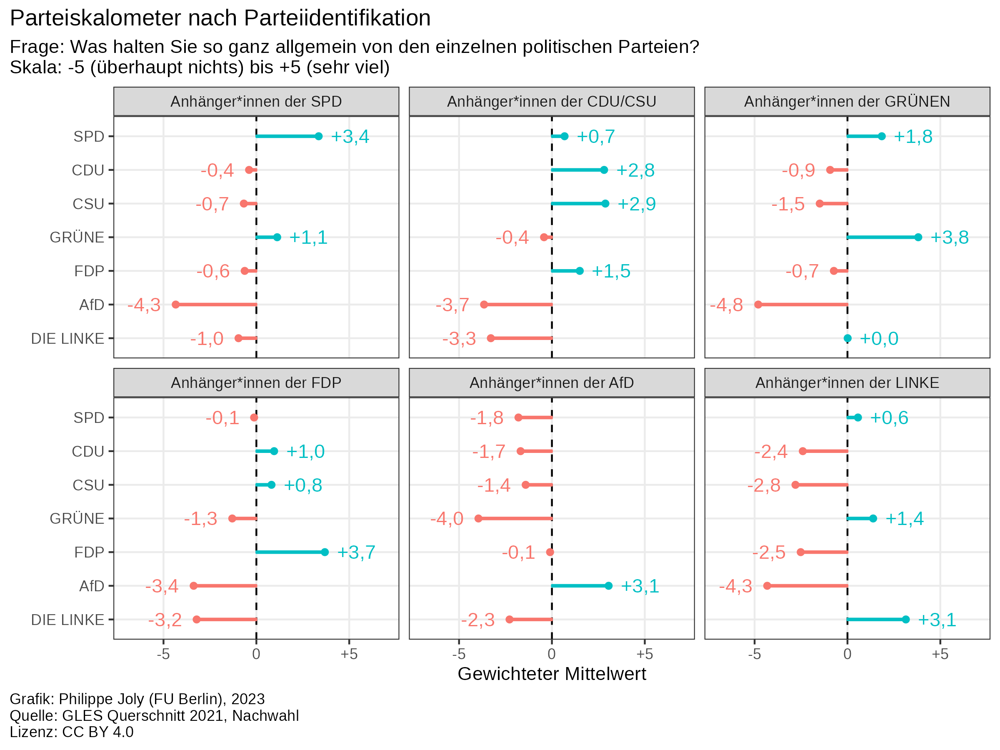

# Plots for a wider audience

## 2023-06-18: Affective polarization in Germany after the 2021 federal election

Data: [GLES Cross-Section 2021, Pre- and Post-Election](https://search.gesis.org/research_data/ZA7702)

Script: [`R/2023-06-18_affective_polarization_gles_2021.R`](R/2023-06-18_affective_polarization_gles_2021.R)

